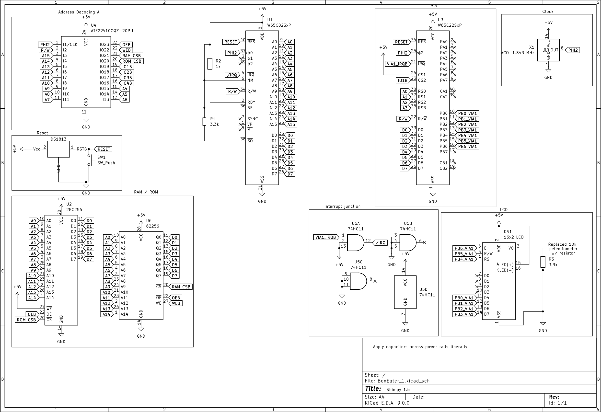

# Shrimpy
This is my attempt at slowly building up a 6502 based microcomputer loosely structured around Ben Eater's lessons. I will wander off and chase squirrels, wrestle with interesting problems, and generally follow the "rule of cool" when deciding what to do next.

*2/22/2025 NOTE: photo is obsolete. Shrimpy has been completely rebuilt. We are now using a PLD for address decoding, a faster clock (currently 1.843 mhz) and an IC for collating interrupts. Using DS1813 for reset circuit now.*

# Current Status
2/23/2025 - Reflowed a lot of the code to make it more human friendly. Finally identified and squished the 'why do I need delays after clearing the lcd in order to see certain text?' bug. I was missing an lcd_wait call if sending chars to the LCD and clears are relatively pokey, so the chars were getting lost.

# Goals
See [Shopping List](shopping_list.md) for parts that I would need to get for these.
- [x] Implement custom characters for the LCD, it NEEDS DINOSAURS
  - [x] Bonus points: make the dinosaur march across the LCD
- [X] Implement PLD memory address decoder to effectively double RAM. (ATF22V10C-7PX)
- [ ] Implement UART DB9 serial adapter
- [x] Get the schematic built in kicad and included in this repository
- [ ] Implement wozmon
- [ ] Implement basic
- [ ] Implement cold start menu that lets user select from basic or wozmon
- [ ] Implement keyboard support (ps2)
- [ ] Implement video using TMS9918
- [ ] Implement storage support either through SPI or I2C

# Current Features
## Hardware
* 4-bit implementation of the LCD
* Wire wrap connections for pretty much everything except for power for durablity and ease of maintenance. Seriously, wire wrapping goes SO GOOD with breadboard prototyping.
* Enhanced durability by removing fragile potentiometers and replacing them with resistors
  * I just dialed in the desired resistence on a potentiometer, measured it using my trusty multimeter, and swapped it out with a resistor. Like the wire wrapped connections, durability is the name of the game.
  * LCD potentiometer was replaced by 3.9K resistor
  * Clock module potentiometer was replaced by a 120k resistor (is that right? I should double check)
* 28 pin ZIF socket for the EEPROM. [https://www.pcbway.com/project/shareproject/Breadboard_to_28p_wide_ZIF_adapter_fc6528ee.html]
* Replaced the 74LS00 address decoder PLD (ATF22V10C)
* Replaced BE's capacitor/resistor reset circuit with a DS1813 (thank you Garth Wilson @ http://wilsonminesco.com/6502primer/RSTreqs.html)
* Using logic AND IC to combine interrupts
## Software
Project was initially based on Ben Eater's keyboard.s [https://eater.net/downloads/keyboard.s]
* Modularized development (no monolithic code, I tried to break the project into distinct files that could be re-used in future efforts)
* Leaning into CC65's provided functionality including:
  * Using the linker configuration file to declare memory blocks, and map segments to the respective memory blocks
  * Using (.res)erved symbols to _declare_ variables and map them to general ram or ZP as appropriate
  * Basically never having to deal with static addresses ever. Everything is dynamically handled by the linker.
  * Exploring & utilizing macros
* Working on heavily restricting the need for and usage of magic number/symbols.
* Got the LCD consistenly initializing on cold start and reset, writing to two lines in both scenarios.
  * Did it by implementing the full initialization by instruction sequence for 4-bit operation
* Custom characters for the LCD (yay dinosaurs)
  * *note to all who follow, getting customer character ram to play nice was a pain. It seems exceptionally touchy about timing and sequence. Be warned*
